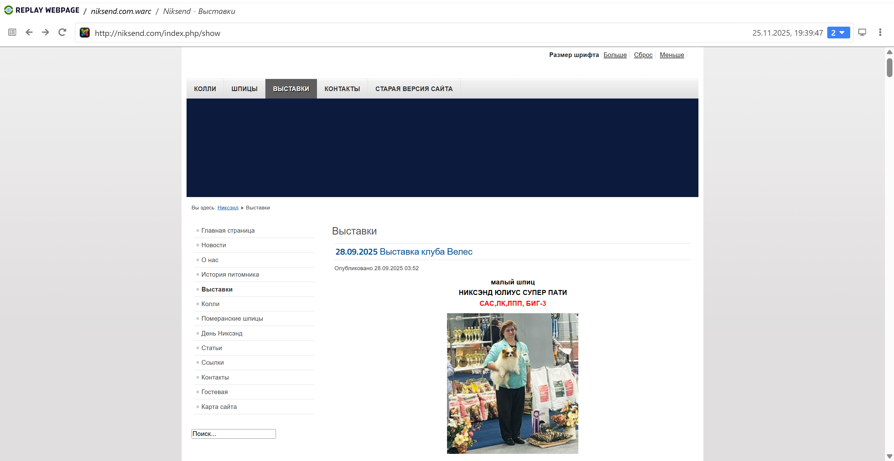
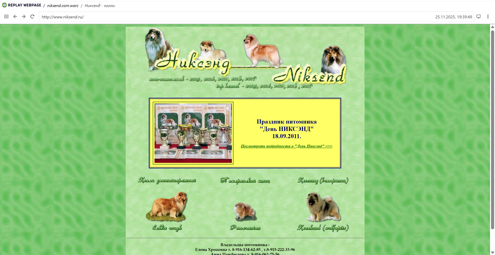
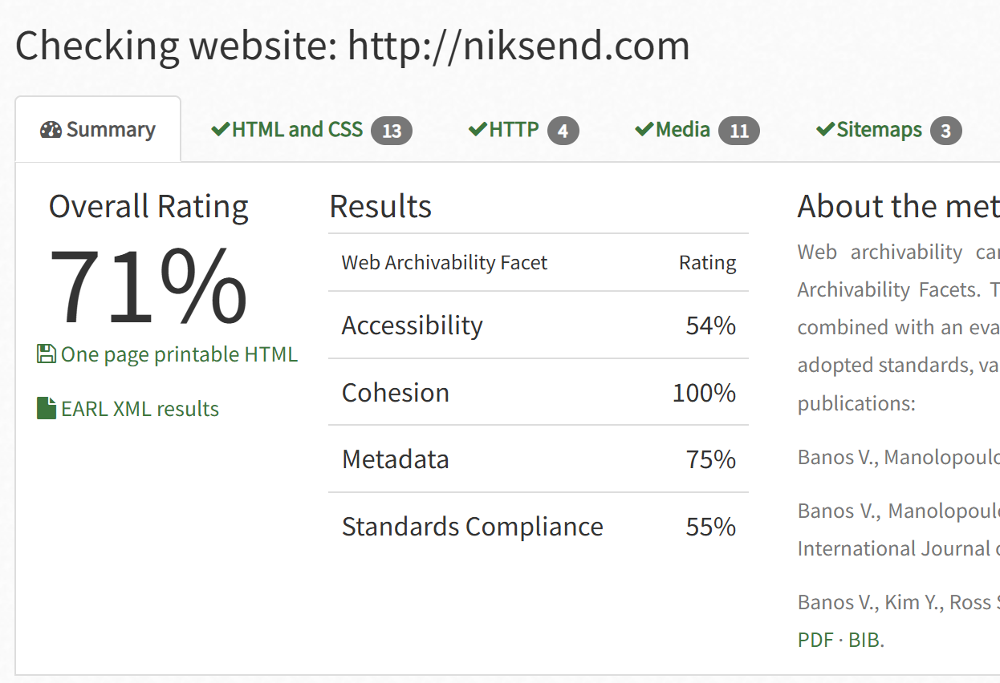

# Архив сайта http://niksend.com
Сайт питомника, занимающегося разведением и продажей шпицев

## wpull 
Архивация при помощи wpull прошла успешно, несмотря на то, что сайт оказался довольно большим (процесс его архивации занял около 7 часов). 

Сайт имеет старую и новую версии, обе хорошо сархивировались и открываются через Replay Webpage

Картинки прогружаются и все разделы сайта доступны к просмотру.

Общий вес warc-файла составил 1.98 Гб.

## ArchiveReady
Проверим архивируемость сайта при помощи сервиса ArchiveReady. 

Несмотря на то, что у нас получилось довольно хорошо сохранить архив сайта, ArchiveReady говорит о не самом хорошем результате - 74%, однако это все еще достаточно высокий результат, который вполне удовлетворяет все наши потребности. По метрикам видно, что в основном процент готовности к архивации снижен из-за показателя Accessibility, основными проблемами является то, что нет файла с картой сайта, а также стоят ограничения для поисковых роботов.

## metawarc
При помощи утилиты metawarc мы смогли проанализировать содержимое сайта, как мы видим, большую часть здесть составляют страницы с текстом, что довольно интересно, так как на первый взгляд сайт не содержит больших статей.
Также на сайте присутствует довольно большое количество видео и более двух тысяч картинок.
Анализ сайта был произведен при помощи команды **metawarc analyze**. Ниже представлена полная таблица с результатами.

| mimes                                 |   files |       size |         share |
| ------------------------------------- | ------- | ---------- | ------------- |
| text/html                             |   14045 |  921369654 |  47.1956 |
| video/mp4                             |      57 |  630697178 |  32.3064 |
| image/jpeg                            |   1615  | 213714259  | 10.9472 |
| text/javascript                       |     541  |  63722222  |  3.26406 |
| application/zip                       |       2  |  44413863  |  2.27503 |
| application/javascript                |     497  |  28831858  |  1.47686 |
| text/css                              |     320  |  18750858  |  0.960481 |
| image/png                             |     512  |  14829283  |  0.759605 |
| font/woff                             |     116  |  3234528   | 0.165683 |
| application/pdf                       |       4   |  2966758  |  0.151967 |
| font/woff2                            |      89   |  1382899  |  0.0708367 |
| application/atom+xml                  |      36   |  1284859  |  0.0658147 |
| application/x-javascript              |      16   |  1212594  |  0.0621131 |
| application/json                      |      22   |  1011940  |  0.0518349 |
| image/webp                            |      32   |   751689  |  0.038504 |
| text/calendar                         |       9   |   722407  |  0.0370041 |
| font/ttf                              |       3   |   712671  |  0.0365054 |
| application/rss+xml                   |      36   |   598172  |  0.0306404 |
| image/x-icon                          |      28   |   521811  |  0.0267289 |
| application/opensearchdescription+xml |     325   |   349876  |  0.0179218 |
| image/svg+xml                         |      68   |   271984   | 0.0139319 |
| image/gif                             |     105   |   191365  |  0.00980235 |
| text/xml                              |       2   |   151974   | 0.00778461 |
| text/plain                            |      47    |  121256   | 0.00621113 |
| font/otf                              |       2   |    96522   | 0.00494418 |
| application/dash+xml                  |      12    |   70065  |  0.00358896 |
| application/octet-stream              |      10   |    66298  |  0.003396 |
| application/vnd.ms-fontobject         |       2   |    41278  |  0.0021144 |
| application/vnd.apple.mpegurl         |      13  |     40252 |   0.00206184 |
| application/x-mpegURL                   |     9    |   19522  |  0.000999982 |
| application/binary                      |    10    |   19447   | 0.00099614 |
| application/xhtml+xml                   |     1    |    8639  |  0.000442518 |
| application/manifest+json               |     1    |    5662  |  0.000290026 |
| application/xml                         |     4    |    3931  |  0.000201359 |
| image/vnd.microsoft.icon                |     2    |    2882  |  0.000147626 |
| #total                                  | 18656 | 1952235804  100 |

Напомню, что сайт интересен нам фотографиями с выставок шпицев, поэтому попробуем собрать два файла с метаданными jpeg и png при помощи команды **metawarc metadata --filetypes png** и **metawarc metadata --filetypes jpeg**. Полученные файлы вложены в папку сайта (niksend.com_meta_jpeg.jsonl и niksend.com_meta_png.jsonl)

В целом проблем при архивации данного сайта  у нас не возникло.
