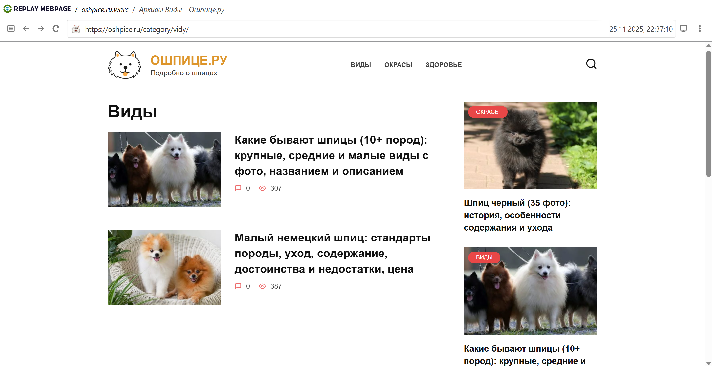
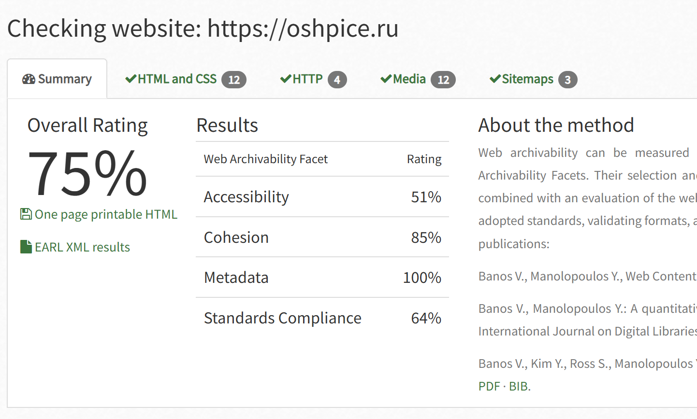

# Архив сайта https://oshpice.ru
Сайт со статьями о видах, различии окрасов и стандартах породы

## wpull 
Архивация при помощи wpull прошла успешно, как я и предполагала, сайт оказался совсем небольшим, процесс его архивации занял меньше часа.

Проверка через Replay Webpage также прошла успешно, картинки сохранены, все разделы кликабельны, на сайте приситсвует возможность оставлять комментарии, однако ни одного комментария никто так и не оставил, а следовательно на сохранение это никак не повлияло.

Общий вес warc-файла составил 119 Мб.

## ArchiveReady
Проверим архивируемость сайта при помощи сервиса ArchiveReady. 

К моему удивлению, несмотря на такой маленький размер сайта, архивируемость сайта составила всего 75%, но рассмотря выделенные проблемы поподробнее, стало ясно, что они такие же как у предыдущего сайта питомника: снижен показатель Accessibility, основными проблемами является то, что нет файла с картой сайта, а также стоят ограничения для поисковых роботов. Но в целом результат архивируемости вполне нормальный.

## metawarc
При помощи утилиты metawarc мы смогли проанализировать содержимое сайта. Здесь как я и ожидала большая часть это jpeg и png, и это неудивительно, в каждой статье по несколько картинок: часть иллюстрируют статью, а часть просто для красоты, каждый заголовок статьи также сопровождается соответсвующей картинкой.
Анализ сайта был произведен при помощи команды **metawarc analyze**. Ниже представлена полная таблица с результатами.

| mimes                         |   files  |    size   |        share |
| ----------------------------- | ------- | ---------  | ------------- |
| image/jpeg                     |    637  | 42437541  |  40.6556 |
| image/png                      |     88 |  37179728  |  35.6186 |
| text/html                       |   168  | 22734148   | 21.7796  |
| image/webp                      |    13   |  613020  |   0.58728 |
| application/x-javascript        |    15   |  513903  |   0.492325 |
| text/css                        |     6   |  352158  |   0.337371 |
| image/svg+xml                   |     2    | 190691  |   0.182684 |
| image/gif                        |    3   |  170799  |   0.163627 |
| application/vnd.ms-fontobject     |   1   |   59215  |   0.0567286 |
| application/font-woff            |    1    |  59103  |   0.0566213 |
| application/octet-stream        |     1    |  59030  |   0.0565514 |
| text/xml                         |    9    |  12062   |  0.0115555 |
| text/plain                       |    2    |    906   |  0.000867958 |
| #total                           |  947 | 104382982  | 100 |

Также как и в предыдущем случае собираем два файла с метаданными jpeg и png при помощи команды **metawarc metadata --filetypes png** и **metawarc metadata --filetypes jpeg**. Полученные файлы вложены в папку сайта (oshpice.ru_meta_jpeg.jsonl и oshpice.ru_meta_png.jsonl)

Проблем при архивации данного сайта  у нас не возникло.
