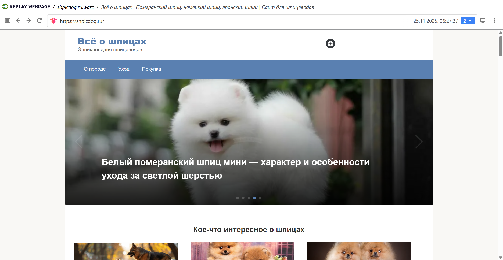
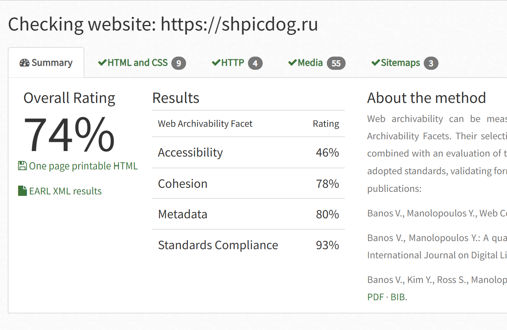

# Архив сайта https://shpicdog.ru
Сайт про здоровье шпицев

## wpull 
Архивация при помощи wpull не вызвала каких-либо проблем, архивировался он около часа.

Ничего особенного на сайте не было, только статьи и картинки к ним, поэтому проверка через Replay Webpage показала хороший результат - все необходимое сохранено.

Общий вес warc-файла составил 256 Мб.

## ArchiveReady
Проверим архивируемость сайта при помощи сервиса ArchiveReady. 

Архивируемость сайта составила 74%. Проблемы здесь в целом такие же, как и у других архивов сайтов: снижен показатель Accessibility, основными проблемами этого является отсутствие файла с картой сайта, а также стоят ограничения для поисковых роботов. Помимо этого несколько картинок отсылают нас на другой источник и могли не сохраниться при архивации, однако я так и не нашла, где они были на нашем сайте, так что делаем вывод, что результат архивируемости хороший.

## metawarc
При помощи утилиты metawarc мы смогли проанализировать содержимое сайта. Сайт состоит из статей и иллюстрируется большим количеством изображений (хотя я ожидала, что их окажется больше). В целом получается, что на каждую статью приходится примерно четыре иллюстрации. Если посмотреть на сам сайт, то эта статистика подтвердится.

Анализ сайта был произведен при помощи команды **metawarc analyze**. Ниже представлена полная таблица с результатами.

| mimes                          |   files  |      size    |      share
| ----------------------------- |  ------- |  --------- |  ------------
| image/png                    |       460 |  185121340  |  73.1986
| image/jpeg                   |       490 |   41075032 |   16.2414
| text/html                    |       113  |  15042664 |    5.948
| application/json             |       689  |   9280897  |   3.66975
| text/xml                     |        91  |    520917   |  0.205975
| image/svg+xml                 |        5  |    451982  |   0.178718
| application/vnd.ms-fontobject |        2  |    332222  |   0.131364
| application/octet-stream      |        2   |   331824  |   0.131206
| text/css                      |        2   |   288519   |  0.114083
| application/x-javascript      |        7   |   280985   |  0.111104
| application/font-woff        |         1   |    98355  |   0.0388904
| application/font-woff2        |        1   |    77521   |  0.0306525
| text/plain                    |        1   |      488  |   0.00019296
| #total                        |     1864 |  252902746 |  100

Также как и в предыдущем случае собираем два файла с метаданными jpeg и png при помощи команды **metawarc metadata --filetypes png** и **metawarc metadata --filetypes jpeg**. Полученные файлы вложены в папку сайта (shpicdog.ru_meta_jpeg.jsonl и shpicdog.ru_meta_png.jsonl)

***Из интересного:*** мне было любопытно, почему в архиве данного сайта png и jpeg разделились практически 50 на 50. Я открыла файлы с метаданными и оказалось, что jpeg формат присутствовал в основном для превью статей, а png уже содержался в самих статьях. 

То, что картинок с заголовками статей больше, мне кажется объясняется тем, что в конце каждой статьи представлены большое количество превью других рекомендуемых статей, поэтому их количество больше.

