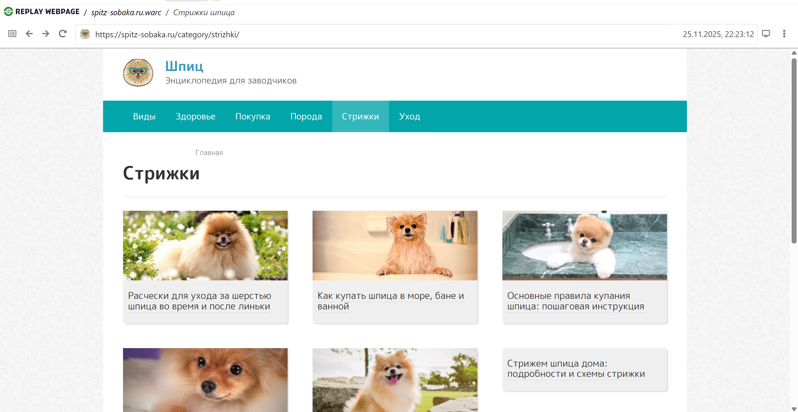
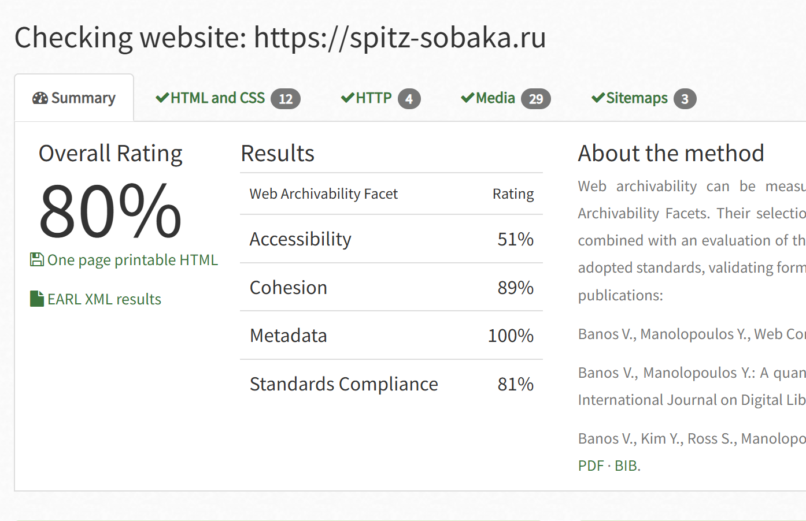

# Архив сайта https://spitz-sobaka.ru
Сайт про выведение новых пород от помеси со шпицами

## wpull 

Архивация при помощи wpull прошла успешно, как я и предполагала, сайт оказался совсем небольшим, процесс его архивации занял меньше часа.

Здесь как и в предыдущем случае ничего особенного на сайте не было, только статьи и картинки к ним, поэтому проверка через Replay Webpage показала хороший результат, однако кое-где не сохранились изображения.

Общий вес warc-файла составил 119 Мб.

## ArchiveReady
Проверим архивируемость сайта при помощи сервиса ArchiveReady. 

Архивируемость сайта составила рекордные для нашей коллекции 80%. Что довольно удивительно, учитывая, что это единственный сайт, где я нашла пробелы в сохранении (отсутсвующая часть картинок). Проблемы здесь такие же как и у всех предыдущих архивов сайтов: снижен показатель Accessibility, нет карты сайта, стоят ограничения для поисковых роботов и у части картинок другой сторонний источник. Также на сайте есть много ссылок на соцсети, которые при архивации никуда не ведут и не сохраняются. В целом, скорее всего это проблемы большинства сайтов. Оценка архивируемости очень хорошая.

## metawarc
При помощи утилиты metawarc мы смогли проанализировать содержимое сайта. Сайт состоит из небольшого количества длинных статей и большого иллюстраций к ним. На каждую статью приходится около 10 картинок.

Анализ сайта был произведен при помощи команды **metawarc analyze**. Ниже представлена полная таблица с результатами.

mimes                         |   files  |     size  |        share
----------------------------- | ------- | --------- | -------------
image/jpeg                    |    1570  | 73287266 |  65.1171
image/png                      |     53  | 17923328 |  15.9252
text/html                     |     198  | 10417532  |  9.25618
application/json              |    1646  |  7487924  |  6.65316
application/x-javascript      |      23  |  1154212  |  1.02554
image/svg+xml                 |       6  |   453613  |  0.403044
application/x-font-ttf         |      4  |   414924  |  0.368668
text/xml                       |     77   |  402780  |  0.357878
application/vnd.ms-fontobject   |     3  |   389054  |  0.345682
text/css                        |     9  |   268030  |  0.23815
application/font-woff          |      3   |  185199  |  0.164553
application/font-woff2        |       3   |  144198  |  0.128123
application/rss+xml           |       2   |   16284  |  0.0144686
image/gif                    |        1   |    1684  |  0.00149627
text/plain                   |        1   |     785  |  0.000697488
#total                       |     3599 | 112546813 | 100

Также как и в предыдущем случае собираем два файла с метаданными jpeg и png при помощи команды **metawarc metadata --filetypes png** и **metawarc metadata --filetypes jpeg**. Полученные файлы вложены в папку сайта (spitz-sobaka.ru_meta_jpeg.jsonl и spitz-sobaka.ru_meta_png.jsonl)

png здесь совсем немного относительно jpeg формала, возможно те файлы, которые были на сторонних сервисах и не поддались архивации, либо на этом сайте просто использовался преимущественно jpeg формат картинок.

Как и в предыдущих случаях, архив не вызвал проблем и собрал все в себе все необходимое.

В целом можно сказать, что вся коллекция сайтов сохранилась очень хорошо, все вкладки кликабельны и соответсвуют изначальной архитектуре сайтов, из недостатков можно отметить только небольшую потерю изображений, однако она незначительна и не играет какой-либо важной роли при использовании архива сайта.
